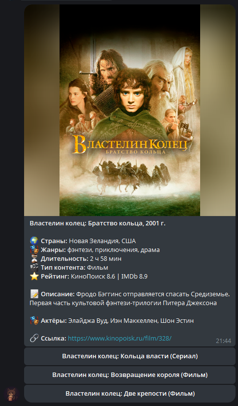
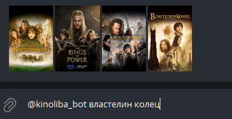

# **КИНОЛИБА** - Telegram-бот для поиска фильмов и сериалов, создания коллекции просмотренного контента и отслеживания выхода новых серий сериалов.

<p align="center">
  
</p>

> [!WARNING]
> Данный инструмент разработан и опубликован исключительно в образовательных целях и предназначен для личного использования. Он не является официальным инструментом и не нарушает условия использования сторонних сервисов, с которыми взаимодействует.
> Автор не несёт ответственности за последствия его использования, включая, но не ограничиваясь, возможными блокировками, ограничениями доступа или юридическими последствиями.
> Ответственность за соблюдение условий использования сторонних сервисов, с которыми взаимодействует инструмент, полностью лежит на пользователе.

**КИНОЛИБА** — это телеграм-бот, работающий с **[HUBBLE API](https://github.com/cloudsucker/kinohubble.git)**, и обеспечивающий удобный интерфейс для получения информации о медиа-контенте, и его добавления в собственную коллекцию просмотренного контента.

Бот позволяет быстро находить контент, добавлять его в список для дальнейшего просмотра, делиться им с друзьями и отслеживать выход новых серий ранее добавленных сериалов.

<p align="center">
  
</p>

> [!NOTE]
> В репозиторий был добавлен демо-функционал работы с `GEMINI API`, при желании его можно довольно просто отключить.
> Но уже сейчас с его помощью можно искать контент по описанию.

## **🧭 Содержание**

-   [🤖 Команды](#-команды)
-   [📦 Установка](#-установка)
-   [🚀 Запуск](#-запуск)
-   [🛰️ HUBBLE API](#%EF%B8%8F-hubble-api)
-   [📬 Обратная связь](#-обратная-связь)

## **🤖 Команды**

-   **`/start`** — начать взаимодействие с ботом.
-   **`/search`** — найти медиа-контент/человека кинематографа по названию/фио соответственно.
-   **`/add`** — найти и добавить медиа-контент в список к просмотру `list`.
-   **`/delete`** — удалить медиа-контент из коллекции.
-   **`/list`** — отобразить фильмы и сериалы, добавленные в коллекцию.
-   **`/viewed`** — отметить контент как просмотренный.
-   **`/share`** — поделиться списком рекомендаций.
-   **`/dates`** — получить даты выхода серий добавленных сериалов.
-   **`/help`** — получить помощь и список команд.

Помимо команд, бот также поддерживает функцию **[inline-query](https://core.telegram.org/bots/inline)** для быстрого прикрепления в чат нужного медиа-контента или человека кинематографа.

<p align="center">
  
</p>

## **📦 Установка**

#### 1. **Клонируйте репозиторий:**

```bash
git clone https://github.com/cloudsucker/kinoliba.git
cd kinoliba
```

#### **2. Создайте виртуальное окружение:**

```bash
python -m venv .venv
```

#### **3. Активируйте виртуальное окружение:**

-   **Windows**:

    ```bash
    .venv\Scripts\activate
    ```

-   **Linux/MacOS**:

    ```bash
    source .venv/bin/activate
    ```

#### 4. **Установите зависимости:**

```bash
pip install -r requirements.txt
```

#### **5. Добавление токена**

Создайте файл для хранения токена Telegram-бота:

```bash
echo ВАШ_ТОКЕН_СЮДА > bot/data/token.txt
```

## **🚀 Запуск**

Запустите файл `main.py` из корня проекта.

## **🛰️ HUBBLE API**

Для получения данных Telegram-бот использует **HUBBLE API**, необходимый для локального развёртывания.

**HUBBLE API** получает информацию с **`КиноПоиск API`** с помощью библиотеки **[kinopapi](https://github.com/cloudsucker/kinopapi.git)** и сервиса toramp.

Все полученные данные в проекте кешируются и сохраняются в директорию `/bot/data/users` в подобном формате:

```json
{
    "id": 464963,
    "type": "tvseries",
    "title_russian": "Игра престолов",
    "title_original": "Game of Thrones",
    "rating_kinopoisk": 8.996,
    "poster_url": "https://avatars.mds.yandex.net/get-kinopoisk-image/1777765/dd78edfd-6a1f-486c-9a86-6acbca940418/orig/",
    "url": "https://www.kinopoisk.ru/series/464963/",
    "release_start": 2011,
    "release_end": 2019,
    "duration": 55,
    "rating_imdb": 9.2,
    "year": 2011,
    "description": "Рыцари, мертвецы и драконы — в эпической битве за судьбы мира. Сериал, который навсегда изменил телевидение",
    "description_long": "К концу подходит время благоденствия, и лето, длившееся почти десятилетие, угасает. Вокруг средоточия власти Семи королевств, Железного трона, зреет заговор, и в это непростое время король решает искать поддержки у друга юности Эддарда Старка. В мире, где все — от короля до наемника — рвутся к власти, плетут интриги и готовы вонзить нож в спину, есть место и благородству, состраданию и любви. Между тем никто не замечает пробуждение тьмы из легенд далеко на Севере — и лишь Стена защищает живых к югу от нее.",
    "countries": ["США", "Великобритания"],
    "genres": ["фэнтези", "драма", "боевик", "мелодрама", "приключения"],
    "duration_series": 55,
    "actors": [
        "Питер Динклэйдж",
        "Лина Хиди",
        "Эмилия Кларк",
        "Кит Харингтон",
        "Софи Тёрнер"
    ],
    "viewed": true,
    "recommend": true
}
```

## 📬 **Обратная связь**

**Репозиторий активно развивается, буду рад обратной связи.**

**По всем вопросам:** ferjenkill@gmail.com
